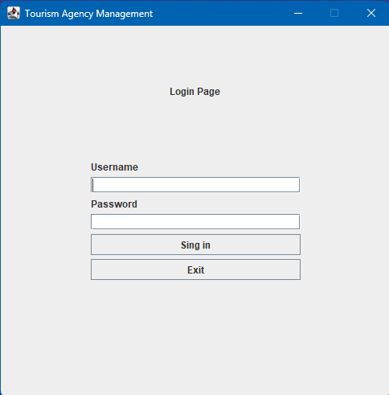
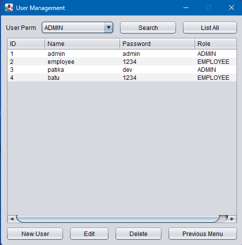
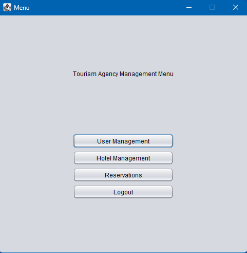
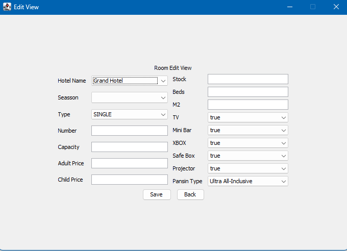
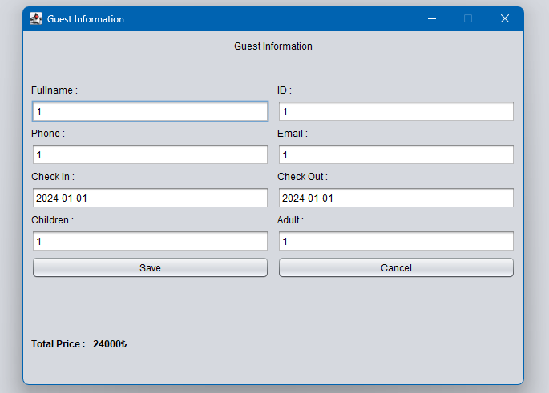

# Patika Tourism Agency Project


This project is a hotel management system developed to digitize the daily operations of Patika Tourism Agency and optimize customer reservation processes.

##
---
    Requires Java 22.0.0 to be controlled

## Features

- There are two types of users: admin and agency staff.
- User management: Admin can add, delete, update users and assign roles.
- Hotel management: Agency staff can add and edit hotels.
- Room management: Agency staff can add and price rooms.
- Period management: Agency staff can add periods for hotels.
- Price management: Agency staff can set room prices.
- Room search: Agency staff can search for rooms based on desired criteria and make reservations.
- Reservation management: Agency staff can list, add, update, and delete reservations.

## Technical Details

- The project is designed according to SOLID principles and MVC architecture.
- PostgreSQL is used as the database.
- SwingGUI is used for the user interface.
- The project follows a multi-layered architecture.

## Installation

1. Clone the project:
    ```bash
    git clone https://github.com/deerborg/Tourism-Agency-Management.git
    ```
2. Install PostgreSQL and update the connection details.
3. Open the project in your IDE.
4. Configure the database connection in `src/main/resources/src/Log/DBconfigure.properties`.
5. Compile and run the project.

## Video
[](https://www.youtube.com/watch?v=64gIdw2fkA0)

## Screenshots

- User Login Screen



- Admin Panel




- Agency Staff Panel



- Hotel Adding Screen


- Room Adding Screen



- Reservation Screen




## Usage

1. Admin logs in and creates the first user.
2. Admin adds agency staff and authorizes them.
3. Agency staff adds hotels and rooms to the system.
4. Agency staff adds periods and sets prices.
5. Agency staff searches for rooms based on customer requests and makes reservations.

## License

This project is licensed under the MIT License. See the [LICENSE](LICENSE) file for details.
